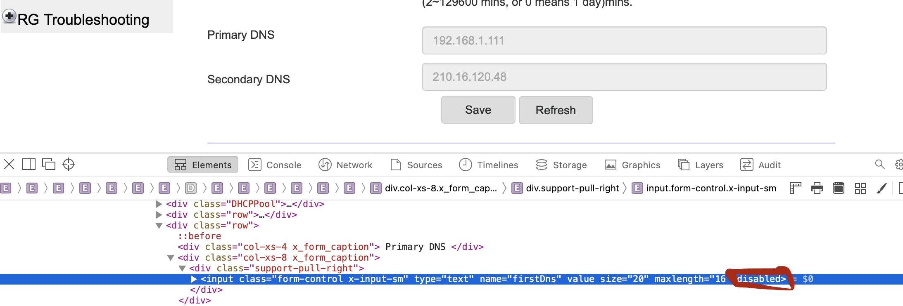

# SSH/Telnet into Nokia G-2425G-A

```
Device Infromation:

Device Name G-2425G-A
Vendor Nokia
Boot Version U-Boot Dec-31-2016--12:00:00
Router IP https://192.168.1.254
Chipset MTK7528
```

Default login for SSH, Telnet CLI, and Web GUI AdminGPON / ALC#FGU. However this can be changed by ISP by using [TR069](https://en.wikipedia.org/wiki/TR-069) after connecting the fiber cable.

There is also another user userAdmin / userAdmin.

### Steps

1. Reset the router so that it is possible to use the AdminGPON user. Another way is to extract the configuration after ISP has setup the modem router using TR-069. (contact me for further info -- see secure notes on phone)
2. Extract the cfg file using [nokia-router-cfg-tool.py](https://gist.github.com/thedroidgeek/80c379aa43b71015d71da130f85a435a)
3. Enable TelnetSSHAccount. in the extracted XML file using the script above. Set username as `ONTUSER` and password as `OYdLWUVDdKQTPaCIeTqniA==` which equates to 
`admin`. If using another username, root access might not be possible.

```xml
<TelnetSshAccount. n="TelnetSshAccount" t="staticObject">
<Enable rw="RW" t="boolean" v="true"></Enable>
<UserName ml="64" rw="RW" t="string" v="ONTUSER"></UserName>
<Password ml="64" rw="RW" t="string" v="2NtCuV9+tykYlr4EmoJFxg==" ealgo="ab"></Password>
</TelnetSshAccount.>
```

4. Set LimitAccount_ONTUSER to `false`. Further, `ONTLOCK` (search the XML file) might also be needed to be set to `false`

```xml
<LimitAccount_ONTUSER rw="RW" t="boolean" v="false"></LimitAccount_ONTUSER>
<X_ASB_COM_ONTLOCK t="boolean" v="false" dv="false" rw="RW"></X_ASB_COM_ONTLOCK>
```

5. Repack the xml file using [nokia-router-cfg-tool.py](https://gist.github.com/thedroidgeek/80c379aa43b71015d71da130f85a435a)
6. Upload the new cfg file into the router. You might want to use a LAN connection for this, but it has been working fine over WLAN for me. 


#### Notes

* After logging to the router portal, greyed-out (disabled) settings can be changed using the inspect element and removing the disabled prop from html. 



#### Sources
1. https://0x41.cf/reversing/2019/10/08/unlocking-nokia-g240wa.html
2. https://blog.fractal-reality.tech/2020/12/26/rooting-airtel-router/
3. https://gist.github.com/thedroidgeek/80c379aa43b71015d71da130f85a435a (See comments as well)
4. https://broadbandforum.co/threads/nokia-g-140w-f-bridge-mode.199535/post-1533663
5. https://github.com/codeanit/til/issues/61
6. [nokia-router-cfg-tool.py](ssh-telnet-nokia-router-cfg-tool.py)